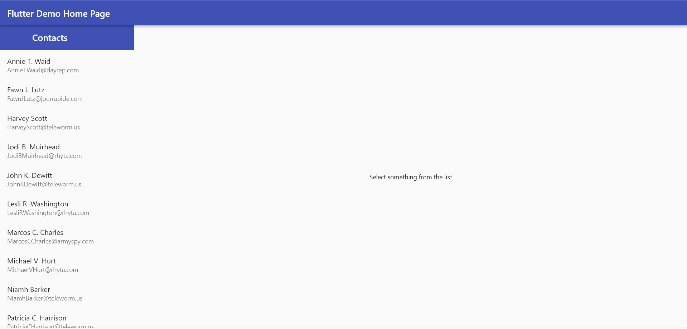
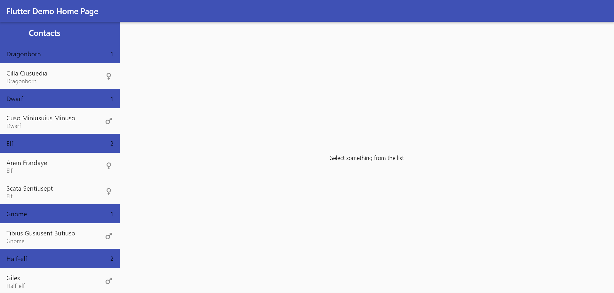
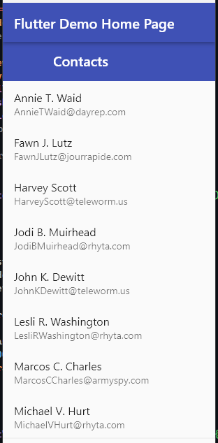
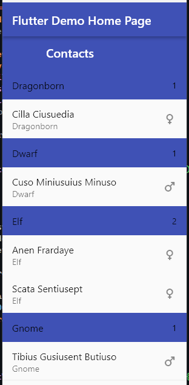

# flutter_master_detail

A Flutter package that simplifies the process of building adaptive master-detail views.

This is a relatively unopinionated package that allows you to customize nearly all aspects of the master detail view in your implementation.

## Getting Started

Import the package:

```dart
import 'package:flutter_master_detail/flutter_master_detail.dart';
```

Use the `MasterDetailsList` widget like any other.

```dart
MasterDetailsList<TElement>( // TElement represents the type of elements that will be present in the `items` parameter.
    items: elementsList, // Mantatory. These elements will be rendered on the master view
    masterItemBuilder: (context, data, isSelected) => {...}, // Mandatory. This determines how the individual elements of the master view will be rendered.
    detailsTitleBuilder: (context, data) => FlexibleSpaceBar(...), // Mandatory. This controls how the title section of the details view.
    detailsItemBuilder: (context, data) => (...), // Mandatory. This controls how the main body of the details section is rendered.
    sortBy: (data) => ..., // Optional. This will be used to sort the elements in the master view while being rendered.
    groupedBy: (data) => ..., // Optional. This will be used to group the list elements while being displayed in the master view. This will also be automatically used to sort the elements of the list before the `sortBy` parameter.
    groupHeaderBuilder: (context, data, itemsCount) => (...), // Optional. You can use this to control how the grouping header will be dispayed. Note that this will not be used if `groupedBy` parameter is not seet.
    title: const FlexibleSpaceBar(...), // Optional. This will be rendered in the title section of the master view.
    masterViewFraction: 0.5, // Optional. This will be used in larger screens. This determines the percentage of viewport width that can be taken up by the master view. Defaults to `0.33333`. Note: The max value is currently capped to 300.
    nothingSelectedWidget: (...), // Optional. This will be used in larger screens. This controls the details view when no element is selected in the master view. Defaults to `Select something from the list`.
    transitionAnimationDuration: ..., // Optional. This determines the duration of the animation for bringing up the details view.
);
```

## Screenshots

### On Larger screens

##### Without Grouping




##### With Grouping


### On Smaller screens

Without Grouping            |  With Grouping
:-------------------------:|:-------------------------:
  |  


